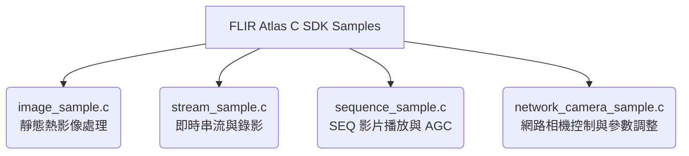

# FLIR Atlas Multiplatform C SDK 開發指南與 Python 對接手冊

本手冊旨在說明 FLIR Atlas Multiplatform C SDK (v2.20.0) 的目錄結構、官方範例邏輯，並詳細指導如何使用 Python 3.12 直接對接該 C SDK，以實現熱成像相機的**即時串流**、**影像擷取**與**真實溫度數據 (Radiometric Data) 導出**。

---

## 1. SDK 簡介與核心特點

FLIR Atlas C SDK 檔案是由 FLIR 官方提供的物件導向 C 語言函式庫，專為熱成像數據擷取與設備控制設計。它具有以下核心特性：

*   **原始數據存取 (Radiometric Data Access)：** 可獲取像素級別的原始熱訊號 (16-bit AD 訊號值) 或直接轉換為攝氏度 (°C)/開氏度 (K) 的雙精度浮點數溫度。
*   **免編譯器、免 GCC，Python 3.12 直接對接：** 由於 SDK 內部已預先編譯為動態連結庫 `atlas_c_sdk.dll`，在 Windows 64-bit 環境下，您**不需要安裝 GCC 或是任何 C++ 編譯器**。只要使用 Python 3.12 (或任何 64-bit Python 3.x 版本) 內建的 `ctypes` 模組，即可在 Python 中直接載入 DLL 並呼叫所有 SDK 功能。
*   **Type-C 連接實體相機是否能讀到真實數據？：**
    **可以，絕對可以。** 當您使用 Type-C 傳輸線將 FLIR E53 連接至電腦時，相機會在系統中註冊為 UVC 視訊裝置與 USB 控制裝置。當 Python 呼叫 `atlas_c_sdk.dll`時，SDK 會透過底層的 USB 協議，直接繞過一般 Webcam 的色彩壓縮限制，讀取並還原相機輸出的 **16-bit 原始輻射溫度訊號**。這意味著您在 Python 中讀取到的每個像素點都是真實的攝氏度數值，而非普通的 RGB 彩色圖片。

---

## 2. SDK 目錄結構解析

解壓縮後的資料夾 `atlas-c-sdk-windows-vs16-x64-mt-2.20.0` 包含以下四個主要子目錄：

| 目錄名稱 | 說明 | 包含的關鍵檔案 |
| :--- | :--- | :--- |
| **`bin/`** | 執行檔與動態連結庫目錄。包含編譯好的範例程式，以及執行時必需的 DLL。 | `atlas_c_sdk.dll` (SDK 核心庫)、FFmpeg 相關庫 (`avcodec-62.dll` 等)、編譯好的範例 `.exe`。 |
| **`include/`**| C 語言標頭檔目錄。定義了所有可以呼叫的 C API 函式與結構體。 | `acs/acs.h` (總入口標頭檔)、`acs/thermal_image.h` (熱成像核心 API)、`acs/enum.h` 等。 |
| **`lib/`** | 靜態連結庫目錄。若使用 C/C++ 開發，編譯時需連結此資料夾中的檔案。 | `atlas_c_sdk.lib` (供 MSVC 編譯器連結使用)。 |
| **`sample/`** | 官方提供的 C 語言範例原始碼，用來演示各種常見的開發情境。 | `image_sample.c`、`stream_sample.c`、`sequence_sample.c`、`network_camera_sample.c`。 |

> [!IMPORTANT]
> **Windows DLL 依賴關係：**
> 在執行 Python 腳本時，系統必須能找到 `bin/` 目錄下的所有 `.dll` 檔案。因此，開發時需要使用 `os.add_dll_directory` 在 Python 中動態載入該目錄。

---

## 3. 官方 C 範例原始碼邏輯分析

官方在 `sample/` 中提供了四個範例，分別對應不同的開發場景：



### ① [image_sample.c](atlas-c-sdk-windows-vs16-x64-mt-2.20.0/sample/image_sample.c) — 靜態熱影像處理
*   **核心功能：** 載入本機的熱成像圖片（通常為 RJPEG 格式），讀取圖片中的中繼資料，並進行色彩渲染與溫度查詢。
*   **程式邏輯流程：**
    1.  使用 `ACS_ThermalImage_openFromFile()` 開啟指定路徑的圖片。
    2.  讀取相機中繼資料（如相機型號、鏡頭資訊、測溫範圍）。
    3.  利用 `ACS_ThermalImage_getMeasurements()` 讀取圖片中已標註的測量區域（如點 Spot、圓形 Ellipse、矩形 Rectangle）。
    4.  示範如何動態調整色彩分佈演算法（如高原直方圖等化 Plateau HistEq、細節增強 ADE 演算法等），並將渲染後的圖片呈現出來。

### ② [stream_sample.c](atlas-c-sdk-windows-vs16-x64-mt-2.20.0/sample/stream_sample.c) — 即時影像串流與錄影
*   **核心功能：** 掃描相機硬體（如 USB 連接的 UVC 相機、GigE Vision 工業相機），啟動即時視訊串流，並進行即時溫度監測與序列錄影。
*   **程式邏輯流程：**
    1.  藉由 `ACS_Discovery_scan()` 自動搜尋局域網或 USB 連接的相機（包括內建模擬器）。
    2.  透過 `ACS_Camera_connect()` 建立連線，並取得相機的串流物件 (`ACS_Stream`)。
    3.  啟動串流 `ACS_Stream_start()`，並註冊新畫面到達時的 Callback 函式 `onImageReceived()`。
    4.  在串流進行中，利用 `ACS_ThermalStreamer_withThermalImage()` 獲取當前影格的 `ACS_ThermalImage`。
    5.  示範在此 Callback 中動態抓取全圖平均、最低、最高溫，以及特定點的即時溫度。

### ③ [sequence_sample.c](atlas-c-sdk-windows-vs16-x64-mt-2.20.0/sample/sequence_sample.c) — SEQ 熱錄影檔播放
*   **核心功能：** 開啟 FLIR 錄製好的熱成像視訊序列檔 (`.seq` / `.csq`)，逐影格播放並進行後處理。
*   **程式邏輯流程：**
    1.  建立 `ACS_ThermalSequencePlayer` 播放器物件並載入視訊檔案。
    2.  獲取總影格數與播放訊框率 (Framerate)。
    3.  進入播放迴圈，使用 `ACS_ThermalSequencePlayer_next()` 移至下一格。
    4.  對每一格 `ACS_ThermalImage` 應用色彩配置與自動增益 (AGC) 設定，將影像渲染輸出至螢幕。

### ④ [network_camera_sample.c](atlas-c-sdk-windows-vs16-x64-mt-2.20.0/sample/network_camera_sample.c) — 網路相機進階控制
*   **核心功能：** 連接網絡型相機（如 A700 系列），示範遠端認證、自動對焦控制，以及動態調整大氣反射溫度、發射率等熱力學參數。
*   **程式邏輯流程：**
    1.  利用 IP 地址建立 `ACS_Identity` 並連線。
    2.  呼叫 `ACS_Camera_authenticate()` 進行安全認證。
    3.  呼叫 `ACS_Remote_Focus_autofocus_executeSync()` 命令相機執行一次性自動對焦。
    4.  示範讀取並動態設定相機的內建參數，例如將反射溫度改為 293.15 K，發射率 (Emissivity) 改為 0.95。

---

## 4. 使用 Python 對接 SDK 的實作範例

Python 可以透過內建的 `ctypes` 模組，直接加載 C SDK 的動態連結庫 `atlas_c_sdk.dll`。

### Python 對接範例一 —— 讀取熱照片並導出像素溫度矩陣

這個指令碼會模擬 `image_sample.c` 的邏輯，開啟一張熱成像 RJPEG 圖片，並將全圖的像素溫度轉換為 Python 的二維矩陣（可直接用於科學計算或 ML）。

```python
import ctypes
import os
import numpy as np

# ----------------- 1. 初始化 SDK 載入 -----------------
# 使用相對路徑（同目錄下尋找 SDK，方便將整個目錄打包給他人執行）
SDK_DIR = os.path.join(os.path.dirname(__file__), "atlas-c-sdk-windows-vs16-x64-mt-2.20.0")
DLL_PATH = os.path.join(SDK_DIR, "bin", "atlas_c_sdk.dll")

if not os.path.exists(DLL_PATH):
    raise FileNotFoundError(f"找不到 DLL 檔案，請確認路徑: {DLL_PATH}")

# Windows 下加載 DLL 需要同時加載其依賴的 ffmpeg dll 檔
if hasattr(os, "add_dll_directory"):
    os.add_dll_directory(os.path.dirname(DLL_PATH))

acs = ctypes.CDLL(DLL_PATH)

# ----------------- 2. 定義 C 語言對應的數據結構 -----------------
class ACS_ThermalValue(ctypes.Structure):
    _fields_ = [
        ("value", ctypes.c_double),  # 溫度數值
        ("unit", ctypes.c_int),      # 單位 (0=Celsius, 1=Fahrenheit, 2=Kelvin)
        ("state", ctypes.c_int)     # 狀態 (1=OK, 0=Invalid)
    ]

class ACS_Rectangle(ctypes.Structure):
    _fields_ = [
        ("x", ctypes.c_int),
        ("y", ctypes.c_int),
        ("width", ctypes.c_int),
        ("height", ctypes.c_int)
    ]

# ----------------- 3. 定義 SDK C 函式原型 -----------------
acs.ACS_ThermalImage_alloc.restype = ctypes.c_void_p
acs.ACS_ThermalImage_alloc.argtypes = []

acs.ACS_ThermalImage_openFromFile.restype = None
acs.ACS_ThermalImage_openFromFile.argtypes = [ctypes.c_void_p, ctypes.c_wchar_p]

acs.ACS_ThermalImage_getWidth.restype = ctypes.c_int
acs.ACS_ThermalImage_getWidth.argtypes = [ctypes.c_void_p]

acs.ACS_ThermalImage_getHeight.restype = ctypes.c_int
acs.ACS_ThermalImage_getHeight.argtypes = [ctypes.c_void_p]

acs.ACS_ThermalImage_getValues.restype = None
acs.ACS_ThermalImage_getValues.argtypes = [
    ctypes.c_void_p,                  # image handle
    ctypes.POINTER(ctypes.c_double),  # valueBuffer
    ctypes.c_size_t,                  # bufferSize
    ctypes.POINTER(ACS_Rectangle)     # rectangle
]

acs.ACS_ThermalImage_free.restype = None
acs.ACS_ThermalImage_free.argtypes = [ctypes.c_void_p]

# ----------------- 4. 實作數據讀取函式 -----------------
def export_thermal_matrix(image_file_path):
    image_handle = acs.ACS_ThermalImage_alloc()
    if not image_handle:
        raise MemoryError("無法分配 ACS_ThermalImage 記憶體")
        
    try:
        acs.ACS_ThermalImage_openFromFile(image_handle, image_file_path)
        
        width = acs.ACS_ThermalImage_getWidth(image_handle)
        height = acs.ACS_ThermalImage_getHeight(image_handle)
        print(f"成功開啟熱成像檔案: {os.path.basename(image_file_path)}")
        print(f"解析度: {width} x {height} 像素")
        
        pixel_count = width * height
        buffer_type = ctypes.c_double * pixel_count
        temp_buffer = buffer_type()
        
        rect = ACS_Rectangle(0, 0, width, height)
        
        acs.ACS_ThermalImage_getValues(
            image_handle, 
            temp_buffer, 
            ctypes.sizeof(temp_buffer), 
            ctypes.byref(rect)
        )
        
        flat_array = np.array(temp_buffer)
        temp_matrix = flat_array.reshape((height, width))
        return temp_matrix
        
    finally:
        acs.ACS_ThermalImage_free(image_handle)
```
