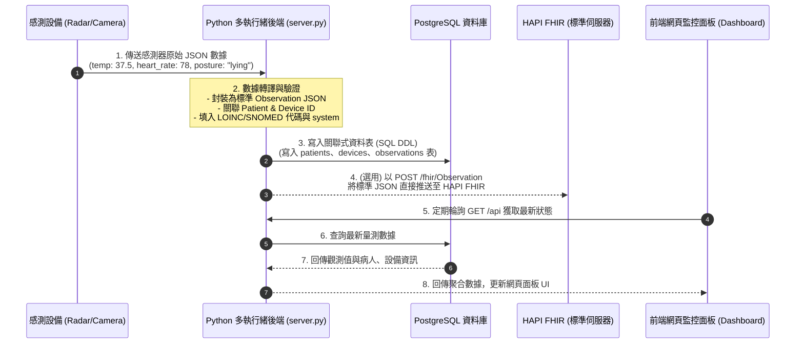
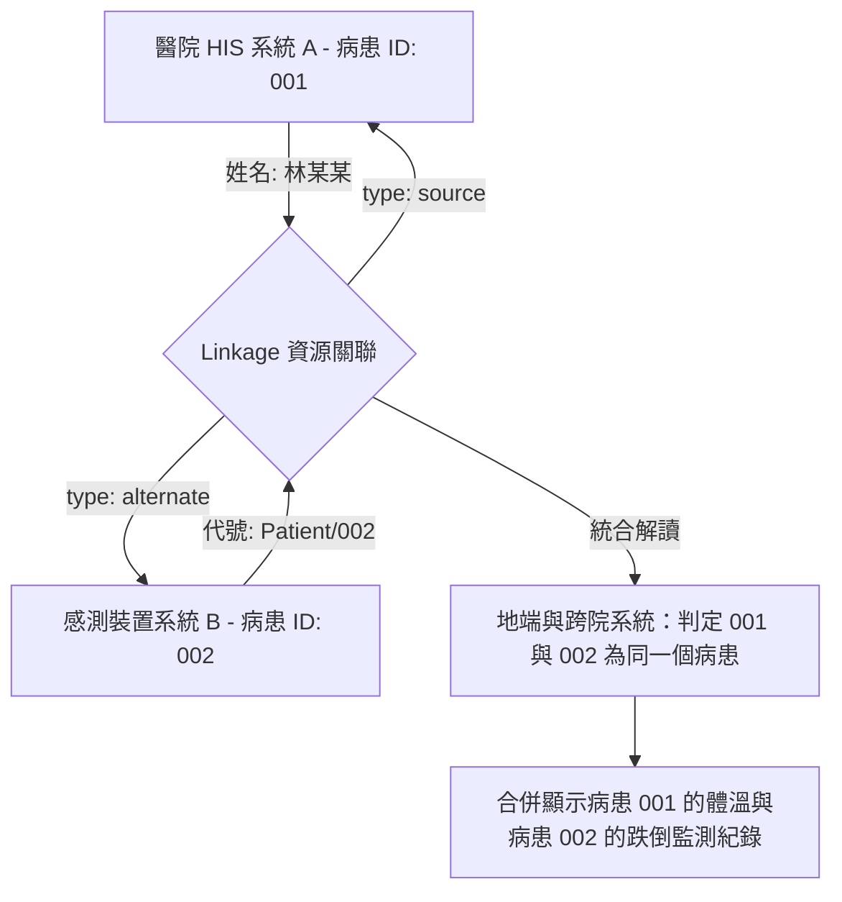

# 合規醫療院所對接 FHIR 資料庫與 JSON 規格書

本文件專為實現「跨院互通」、「符合衛生福利部 TW Core IG 規範」所設計。定義了在 PostgreSQL 資料庫中必須建立的**關聯式實體資料表（SQL Schema）**，以及資料交換時必須封裝的 **FHIR JSON 欄位結構**。

---

## 1. 醫療合規資料庫設計 (PostgreSQL SQL Schema)

為了符合 FHIR 的實體關聯規範（Patient ➔ Device ➔ Observation），地端資料庫必須捨棄單一扁平表，改為以下三張核心關聯表：

### ① 病患基本資料表 (`patients`)
```sql
CREATE TABLE patients (
    id VARCHAR(50) PRIMARY KEY,                    -- 對應 FHIR Patient.id (系統識別碼)
    mrn VARCHAR(50) UNIQUE NOT NULL,               -- 病歷號/身分證字號 (FHIR Patient.identifier - 必填)
    name VARCHAR(100) NOT NULL,                    -- 姓名 (FHIR Patient.name - 必填)
    gender VARCHAR(10) NOT NULL,                   -- 性別 (FHIR Patient.gender: male/female/other - 必填)
    birth_date DATE NOT NULL,                      -- 出生日期 (FHIR Patient.birthDate - 必填)
    created_at TIMESTAMP WITH TIME ZONE DEFAULT CURRENT_TIMESTAMP
);
```

### ② 監測設備資料表 (`devices`)
```sql
CREATE TABLE devices (
    id VARCHAR(50) PRIMARY KEY,                    -- 對應 FHIR Device.id
    serial_number VARCHAR(100) UNIQUE NOT NULL,    -- 設備唯一序號 (FHIR Device.identifier)
    manufacturer VARCHAR(100) NOT NULL,            -- 製造商 (如: FLIR, Infineon)
    model_number VARCHAR(100) NOT NULL,            -- 型號 (如: E53, MR60)
    device_type VARCHAR(100) NOT NULL,             -- 設備類型 (如: Thermal-Camera, Radar)
    created_at TIMESTAMP WITH TIME ZONE DEFAULT CURRENT_TIMESTAMP
);
```

### ③ 生理與行為觀測指標表 (`observations`)
```sql
CREATE TABLE observations (
    id SERIAL PRIMARY KEY,
    patient_id VARCHAR(50) NOT NULL REFERENCES patients(id) ON DELETE CASCADE,  -- 關聯病患 (必填)
    device_id VARCHAR(50) REFERENCES devices(id) ON DELETE SET NULL,            -- 關聯感測器 (強烈推薦)
    status VARCHAR(20) NOT NULL DEFAULT 'final',                                -- 狀態 (final - 必填)
    category VARCHAR(50) NOT NULL,                                              -- 分類 (vital-signs 或 survey)
    loinc_code VARCHAR(20) NOT NULL,                                            -- 國際 LOINC Code (必填)
    recorded_at TIMESTAMP WITH TIME ZONE NOT NULL,                              -- 量測時間戳記 (必填)
    
    -- 數值型數據存儲欄位 (適用於體溫、心率、呼吸率)
    value_numeric NUMERIC(6, 2),                                                -- 量測數值
    value_unit VARCHAR(20),                                                     -- 單位 (如: Cel, /min)
    
    -- 狀態型數據存儲欄位 (適用於姿態、跌倒、離床)
    value_code VARCHAR(50),                                                     -- SNOMED CT 狀態碼 (如: 102538003)
    value_display VARCHAR(100),                                                 -- 狀態中文名稱 (如: 躺著, 離床)
    
    created_at TIMESTAMP WITH TIME ZONE DEFAULT CURRENT_TIMESTAMP
);

-- 建立時間與病患索引，優化跨院大量查詢效能
CREATE INDEX idx_obs_patient_code ON observations(patient_id, loinc_code);
CREATE INDEX idx_obs_time ON observations(recorded_at DESC);
```

---

## 2. 交換與傳輸 JSON 欄位規格 (JSON Payload)

當其他醫院或衛生福利部平台要求提取數據時，後端必須能輸出標準符合 **HL7 FHIR R4** 與 **TW Core IG** 的 JSON 物件。

### ① 數值型資料 JSON 範例：心率 (Heart Rate)
```json
{
  "resourceType": "Observation",
  "status": "final",
  "category": [
    {
      "coding": [
        {
          "system": "http://terminology.hl7.org/CodeSystem/observation-category",
          "code": "vital-signs",
          "display": "Vital Signs"
        }
      ]
    }
  ],
  "code": {
    "coding": [
      {
        "system": "http://loinc.org",
        "code": "8867-4",
        "display": "Heart rate"
      }
    ]
  },
  "subject": {
    "reference": "Patient/patient-01"
  },
  "device": {
    "reference": "Device/device-mr60-01"
  },
  "effectiveDateTime": "2026-07-13T10:35:00+08:00",
  "valueQuantity": {
    "value": 78,
    "unit": "beats/minute",
    "system": "http://unitsofmeasure.org",
    "code": "/min"
  }
}
```

### ② 狀態型資料 JSON 範例：跌倒辨識 (Fall Detection)
```json
{
  "resourceType": "Observation",
  "status": "final",
  "category": [
    {
      "coding": [
        {
          "system": "http://terminology.hl7.org/CodeSystem/observation-category",
          "code": "survey",
          "display": "Survey"
        }
      ]
    }
  ],
  "code": {
    "coding": [
      {
        "system": "http://loinc.org",
        "code": "75276-6",
        "display": "Accidental fall indicator"
      }
    ]
  },
  "subject": {
    "reference": "Patient/patient-01"
  },
  "device": {
    "reference": "Device/device-radar-01"
  },
  "effectiveDateTime": "2026-07-13T10:35:10+08:00",
  "valueCodeableConcept": {
    "coding": [
      {
        "system": "http://snomed.info/sct",
        "code": "242526002",
        "display": "Accidental fall"
      }
    ],
    "text": "跌倒"
  }
}
```

---

## 3. 官方權威來源、連結與原話出處 (References)

1.  **台灣衛福部 TW Core IG 病患 (Patient) Profile 規範**：
    *   *連結網址*：[TW Core Patient Profile](https://twcore.mohw.gov.tw/ig/twcore/StructureDefinition-Patient-twcore.html)
    *   *衛福部規範原話指出*：
        > 「本 Profile 繼承自 base Patient Resource，並額外規定：Patient.identifier (至少包含一個病歷號/身分證字號/健保卡號，基數 1..*)、Patient.name (病患中文或英文姓名，基數 1..*)、Patient.gender (生理性別，基數 1..1) 必須填寫，此為 Must Support 核心欄位以供跨院索引與身分核對。」
2.  **台灣衛福部 TW Core IG 生命徵象 (Vital Signs) 規範**：
    *   *連結網址*：[TW Core Observation Vital Signs Profile](https://twcore.mohw.gov.tw/ig/twcore/StructureDefinition-Observation-vitalSigns-twcore.html)
    *   *衛福部規範原話指出*：
        > 「對於生命徵象的 Observation Profile，其 status (狀態) 基數為 1..1、code (LOINC 代碼) 基數為 1..1、subject (關聯病人) 基數為 1..1，且 valueQuantity (量測數值與符合國際 UCUM 單位) 為強烈建議填寫的 Must Support 欄位，用以維持數據的一致性與可跨院交換性。」
3.  **HL7 FHIR 國際官方設備 (Device) 資源定義**：
    *   *連結網址*：[HL7 FHIR Device Specification](https://hl7.org/fhir/R4/device.html)
    *   *HL7 規範原話指出*：
        > 「A Device resource represents a type of a manufactured item that is used in the provision of healthcare... Device.identifier, manufacturer, modelNumber, and serialNumber are critical for tracking and identification of medical devices across clinical networks.」
4.  **LOINC 國際醫學術語數據庫 (LOINC Codes)**：
    *   *連結網址*：[LOINC Search Portal](https://loinc.org/)
    *   *LOINC 規範原話指出*：
        > 「LOINC provides a set of universal codes and identifiers for identifying laboratory and clinical test results... for body temperature, `8310-5` must be used with the UCUM code `Cel` for unified Celsius measurements.」

---

## 4. 什麼是 Bundle 與 Linkage JSON？（資料聚合與病人識別整合）

您提供的 JSON 是一個非常標準的 **FHIR 資源打包與關聯範例**。它由兩大資源組成，解決了「如何打包多筆資料」以及「如何合併不同院區重複的病人紀錄」之問題：

### ① `resourceType: "Bundle"` (資料包)
*   **概念**：`Bundle` 是 FHIR 的容器資源。您可以把它想像成一個「資料夾」或「SQL 查詢結果集」。當我們要一次傳送多筆資料（例如搜尋病人），或是執行批次寫入時，必須把所有資源打包在 `Bundle` 裡面。
*   `type: "searchset"` 代表這是一個**搜尋結果集**，裡面包含符合搜尋條件的病人與關聯資料。

### ② `resourceType: "Linkage"` (紀錄關聯)
這是在大型醫院（跨院區、跨HIS系統）中最重要的身分整合資源，用於解決**「同人不同號」**的問題。
*   在您的 JSON 中：
    *   **主紀錄 (source)** 指向 `Patient/001`（病患：林某某）。
    *   **替代紀錄 (alternate)** 指向 `Patient/002`。
*   **臨床意義**：這行關聯告訴系統：**「在我們的系統中，病人 001（林某某）與另一個系統/病歷號所記錄的病人 002，其實是同一個真實世界中的人。」** 這有助於防止醫生在看診時因為同人不同病歷號而漏看過往的測溫、心率或跌倒史。

---

## 5. 什麼是 `system` 欄位？為什麼 SNOMED 網址會 404？

當您看到 `"system": "http://snomed.info/sct"` 並嘗試用瀏覽器打開它卻得到 **404 Not Found** 錯誤時，這是所有 FHIR 開發初學者最常遇到的困惑。

### 💡 核心觀念：`system` 是「邏輯識別元」，不是「網頁網址」

1.  **特異規範識別元 (Canonical URI)**：
    在 FHIR 中，`system` 欄位填寫的是一個 **Canonical URI（邏輯識別字串）**。它看起來像網址（以 `http://` 開頭），但**它的主要作用是作為一個唯一的名字空間（Namespace）**，就像身分證字號一樣，用來告訴電腦「這個代碼是從哪裡來的」。
2.  **為什麼要這樣設計？**
    如果沒有 `system`，代碼 `"102538003"` 就只是一串無意義的數字。但只要帶上 `"system": "http://snomed.info/sct"`，全世界任何一家醫院的電腦一讀，就知道「這串數字必須去 **SNOMED CT 國際醫學術語資料庫** 中查找，代表『躺姿』」。
3.  **為什麼會 404？**
    因為 `http://snomed.info/sct` 是一個「邏輯名稱」，SNOMED 組織**沒有**在這個網址上架設一個供人類瀏覽的網頁。軟體在運作時，只會比對這串字串是否完全相符，並不會真的派瀏覽器去打開它。

> ⚠️ **結論**：在程式碼與 JSON 中，必須一字不差地寫入邏輯網址（例如 SNOMED CT 寫死 `http://snomed.info/sct`，LOINC 寫死 `http://loinc.org`），**這是國際標準語意宣告，請勿隨意修改**。

---

## 6. 資料流向與整合流程圖 (System Workflows)

### ① 數據採集與 FHIR 標準化流程 (Data Lifecycle)
下圖呈現了從物理感測器獲取訊號、後端伺服器對接資料庫，最終在前端視覺化展示的完整資料流向：



### ② 病人重複紀錄關聯流程 (Linkage Resource Flow)
當兩筆不同來源的病人數據被 `Linkage` 資源關聯在一起時，系統的解讀流程如下：



